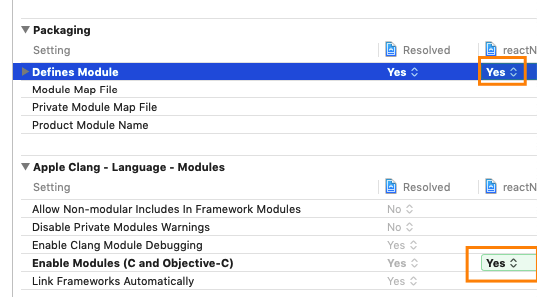

# react-native-pushdy (RNPushdy)


React Native SDK for [Pushdy](https://guide.pushdy.com/i/) services

## Table of contents
- [Getting started](#getting-started)
  - [Installing](#installing)
  - [Linking](#linking)
  - [Update new RNPushdy version (if needed)](#update-new-rnpushdy-version-if-needed)
- [Additional setup:](#additional-setup)
  - [Android](#android)
  - [iOS](#ios)
- [Pushdy configuration](#pushdy-configuration)
- [Usage](#usage)
- [Common use case](#common-use-case)
  - [1. Initialization in react-native](#1-initialization-in-react-native)
  - [2. Subscribe to notification open event](#2-subscribe-to-notification-open-event)
  - [3. And Subscribe to new notification](#3-and-subscribe-to-new-notification)
  - [4. Ensure permission](#4-ensure-permission)
  - [5. Handle user click on notification in notification tray](#5-handle-user-click-on-notification-in-notification-tray)
- [API References](#api-references)
  - [setTimeout(ttl)](#settimeoutttl)
  - [sampleMethod(str, num)](#samplemethodstr-num)
  - [initPushdy(options)](#initpushdyoptions)
  - [isRemoteNotificationRegistered()](#isremotenotificationregistered)
  - [isNotificationEnabled()](#isnotificationenabled)
  - [enablePushdyInAppBanner(enable)](#enablepushdyinappbannerenable)
  - [setPushBannerAutoDismiss(autoDismiss: boolean)](#setpushbannerautodismissautodismiss-boolean)
  - [setPushBannerDismissDuration(sec: number)](#setpushbannerdismissdurationsec-number)
  - [setCustomPushBanner(viewType: String)](#setcustompushbannerviewtype-string)
  - [setCustomMediaKey(mediaKey: String)](#setcustommediakeymediakey-string)
  - [setDeviceId(id: String)](#setdeviceidid-string)
  - [getDeviceId()](#getdeviceid)
  - [setReadyForHandlingNotification(enable)](#setreadyforhandlingnotificationenable)
  - [getReadyForHandlingNotification()](#getreadyforhandlingnotification)
  - [startHandleIncommingNotification()](#starthandleincommingnotification)
  - [stopHandleIncommingNotification()](#stophandleincommingnotification)
  - [getPendingNotification()](#getpendingnotification)
  - [getPendingNotifications()](#getpendingnotifications)
  - [getInitialNotification()](#getinitialnotification)
  - [setAttribute(attr: String, value)](#setattributeattr-string-value)
  - [pushAttribute(attr: String, value, commitImmediately: boolean)](#pushattributeattr-string-value-commitimmediately-boolean)
  - [getPlayerID()](#getplayerid)
  - [methodFoo(...args)](#methodfooargs)
  - [isAppOpenedFromPush()](#isAppOpenedFromPush)
- [Events References](#events-references)
  - [onTokenUpdated](#ontokenupdated)
  - [onNotificationOpened](#onnotificationopened)
  - [onNotificationReceived](#onnotificationreceived)
  - [onRemoteNotificationRegistered](#onremotenotificationregistered)
  - [onRemoteNotificationFailedToRegister](#onremotenotificationfailedtoregister)
- [Version compatible](#version-compatible)
- [Common issues](#common-issues)
  - [ios Setup](#ios-setup)

TOC was generated [here](https://magnetikonline.github.io/markdown-toc-generate/)

## Getting started

#### Prerequisite

Prerequisite:
- react-native@0.61.x and above. The reasons:
    - 0.5x was not tested yet, and too old to support
    - 0.60.x does not support `use_frameworks!`, and WritableMap, ReadableMap have breaking changes from 0.60 to 0.61
- Cocoapod@1.7 and above, tested on v1.8.4, to support swift_versions range

#### Installing
using yarn or npm:
```
$ npm install react-native-pushdy --save
$ yarn add react-native-pushdy
```

#### Linking
- For react-native@0.60.x and above: Autolink was introduce, you don't need to do anything further, for more detail: https://github.com/react-native-community/cli/blob/master/docs/autolinking.md
- For react-native@0.5x.x, run:
```
$ react-native link react-native-pushdy
```

#### Update new RNPushdy version (if needed)
Fetch new version from npm:
```
yarn upgrade react-native-pushdy
```

Then update Pushdy's native library:

**Android Studio**: File > Sync project with graddle files (if you start project by android studio)

**Ios**, run:
```
pod install --project-directory=ios
```

## Additional setup:
PushNotification requires very deep integration, additional setup is required to support its handy features:

NOTE: You need to complete [Pushdy configuration](#Pushdy-configuration) to receive push notification

#### Android

android/app/src/main/java/**/MainApplication.java
```
    import com.reactNativePushdy.PushdySdk;  // <---- Import RNPushdy
    ...

    @Override
    public void onCreate() {
      ...
      // ----- Add Pushdy module
      String clientKey = BuildConfig.DEBUG
              ? "eyJhbGciOiJIUz****"
              : "eyJhbGciOiJIUz****";
      PushdySdk.getInstance().registerSdk(clientKey, this, R.mipmap.ic_notification);
      // ----- End add Pushdy module
      ...
    }
```


Override your MainActivity (ussually MainActivity.java)
```
  // Add this fn to MainActivity
  @Override
  public void onNewIntent(Intent intent) {
    setIntent(intent);
    super.onNewIntent(intent);
  }
  ...
```

#### iOS
Prerequisites:
- Swift enabled, support `use_frameworks!` in your Podfile. You Podfile would look like:
  ```
  platform :ios, '9.0'
  require_relative '../node_modules/@react-native-community/cli-platform-ios/native_modules'

  target 'youProject' do
    use_frameworks!     # <--- This line must be present

    # Pods for react-native
    pod 'FBLazyVector', :path => "../node_modules/react-native/Libraries/FBLazyVector"
    pod 'FBReactNativeSpec', :path => "../node_modules/react-native/Libraries/FBReactNativeSpec"
    pod 'RCTRequired', :path => "../node_modules/react-native/Libraries/RCTRequired"
    pod 'RCTTypeSafety', :path => "../node_modules/react-native/Libraries/TypeSafety"
    # more pods here

    use_native_modules!
  end
  ```


AppDelegate.m
```
#import <react_native_pushdy/react_native_pushdy-Swift.h>

- (BOOL)application:(UIApplication *)application didFinishLaunchingWithOptions:(NSDictionary *)launchOptions
{
  ...

  // ----- Add Pushdy module
  NSString *clientKey;
  #if DEBUG
    clientKey = @"eyJhbGciOiJIUzI1*****";
  #else
    clientKey = @"eyJhbGciOiJIUzI1*****";
  #endif

  [RNPushdy registerSdk:clientKey delegate:self launchOptions:launchOptions];
  // ----- End add Pushdy module

  ...
  return YES;
}
```


Next steps:
- [Pushdy dashboard configuration](#Pushdy-configuration)
- [Common use case > Initialization in React-native](#Common-use-case)


## Pushdy configuration
Để nhận được push bạn cần cấu hình trên dashboard của Pushdy trước:

iOS:  
[Hướng dẫn tích hợp Pushdy mobile push cho iOS app](https://guide.pushdy.com/i/cai-dat-mobile-push/ios)  
> Chú ý: bỏ qua bước **3. Cài đặt SDK cho iOS app**

Android:  
[Hướng dẫn tích hợp Pushdy mobile push cho Android app.](https://guide.pushdy.com/i/cai-dat-mobile-push/android)  
> Chú ý: bỏ qua bước **3. Cài đặt SDK cho Android app**


Để đảm bảo push được nhận từ background nhanh chóng, cần sửa main activity `launchMode="singleTop"`:
```
<activity
          android:name=".MainActivity"
          android:label="@string/app_name"
          ...
          android:launchMode="singleTop"     <----- Add this line
          ...
          android:windowSoftInputMode="adjustResize">
```
Như vậy, mỗi khi open app từ backround lên app sẽ không bị recreate lại JS thread, vẫn dùng JS thread cũ, sẽ không bị miss các message từ Native truyền qua.


## Usage
```javascript
import Pushdy from 'react-native-pushdy';

const [msg, x2num] = await Pushdy.sampleMethod('Hello from JS with', 500);
```
See more at [API References](#API-References) and **common use case** section bellow.

Checkout RNPushdy in this example project: react-native-pushdy-example: 
https://github.com/Pushdy/react-native-pushdy-example

and `react-native-pushdy-example/src/services/Pushdy/PushdyMessaging.js`

## Common use case
Bellow is common use cases, for api references, please see [API References](#API-References) section

[WIP] This usage guide has not completed yet.

#### 1. Initialization in react-native

Initialization flow:
- PushdySDK (native ios/android sdk) connect to FCM / APNS and get the push token
- RNPushdy (react-native-pushdy) register some needed event listeners, so that Pushdy can handles the events sented by PushdySDK to JS


```
  async register() {
    // [Required] read the API reference for more detail.
    // This is required line, do forget to set Device Id: Use T19 device ID as pushdy device id
    await Pushdy.initPushdy({ deviceId: 'YOUR_USER_DEVICE_UID' });

    // Remember to subscribe asap
    // On android: You must call this fn, at least with no params: Pushdy.startSubscribers();
    Pushdy.startSubscribers({
      onNotificationOpened: ({notification, fromState}) => {},
      onNotificationReceived: ({notification, fromState}) => {},
      onRemoteNotificationFailedToRegister: (event) => {},
      onRemoteNotificationRegistered: (event) => {},
      onTokenUpdated: ({ deviceToken }) => {},
    });

    // Ensure that push was allowed by user, Please see PushdyMessaging.js for more detail
    this.ensurePermission().then(enabled => {});

    // Check for non-executed push on app opening, Please see PushdyMessaging.js for more detail
    this.handleInitialNotification();
  }

  unregister() {
    Pushdy.stopSubscribers();
  }
```
Done.

Now go to https://dashboard.pushdy.com/#/application/your_project_id/notification and create a new notification.

A notification should appear on your device.

You may take a look at [Common issues](#Common-issues) section in the future.


#### 2. Subscribe to notification open event
#### 3. And Subscribe to new notification
```
Pushdy.startSubscribers({
  onNotificationOpened: ({notification, fromState}) => {},
  onNotificationReceived: ({notification, fromState}) => {},
  onRemoteNotificationFailedToRegister: (event) => {},
  onRemoteNotificationRegistered: (event) => {},
  onTokenUpdated: ({ deviceToken }) => {},
});
```

See [docs](#) for more details

#### 4. Ensure permission

    Permission was automatically request permission while ios requires you to request manually:
    ```
    await Pushdy.ios_registerForPushNotification();
    ```

#### 5. Handle user click on notification in notification tray

    If app is closed, click on a notification will open app, you need to manually get the clicked notification and handle it.

    When your app is in closed state (not background), incomming notification message will be handled and show by OS, you can find it in the OS's notification center
    Then user press the notification, the app will be opened with that notification data, that data called pendingPushNotification

    After JS thread was ready, PushdySDK was ready, you need to check if there is a pendingPushNotification and handle it
    In some other SDK, pendingPushNotifications also known as initialNotifications

    ```
      async handleInitialNotification() {
        // Get the clicked push notification while app is closed or in background
        const pendingNotification = await Pushdy.getPendingNotification();

        if (pendingNotification) {
          /**
           * Handle the bug if notification was re-handle if Codepush.restart()
           */
          const lastInitialId = getLastNotiIdFromLocalStorage();
          const initialId = pendingNotification._notificationId;
          if (lastInitialId && lastInitialId === initialId) {
            // Ignore if this notification have been handled
            console.log('Notification was already handled in last session, skip:  notificationId: ', lastInitialId);
            return
          }

          setLastNotiIdFromLocalStorage(initialId);

          this.handleMyAppPushAction(pendingNotification, 'background')
        }
      }
    ```


## API References
Bellow is RNPushdy's API References, for common use cases, please see [Common use case](#Common-use-case) section


##### setTimeout(ttl)
Signature: 
```
/**
* @param {Number} ttl Time to live in miliseconds. Default to 10,000 ms
*/
setTimeout(ttl)
```

Desc: 
> Set timeout for all function execution, if a Pushdy's function does not response after `ttl` milisecs then async function will return a Promise<undefined>
>

Usage:
```
Pushdy.setTimeout(5000);
```

##### sampleMethod(str, num)
Signature: 
```
async sampleMethod(str, num)
```

Desc: 
> If sampleMethod work then RNPushdy was correctly installed and working.

Usage:
```
const [msg, x2num] = await Pushdy.sampleMethod('Hello from JS with', 500);
```


##### initPushdy(options)
Signature:
```
async initPushdy(options)
```

Desc:
> Init RNPushdy SDK whenever you want
>
> Then your app can receive and handle push from APNs / FCM
> You must call this method once & only once in your app life cycle.
>
> Params:
> - options: An json object contain key-value configuration pair, all pair are optional except `deviceId`
>
> Available optional key:
> - deviceId: [REQUIRED] Custom user id, read [setDeviceId()](#setdeviceidid-string) for more detail.

Usage:
```
await Pushdy.initPushdy({
    deviceId: 'read docs above',      // <----- required key
});
```

##### isRemoteNotificationRegistered()
Signature: 
```
 /**
   * @returns {Promise<Boolean>}
   */
  async isRemoteNotificationRegistered()
```

Desc:
> App finished registering notification with APNs / FCM
> From now on, your app is valid to receive notification
> NOTE: This does not mean you can receive notification, please check `isNotificationEnabled()` and `getReadyForHandlingNotification()`

Usage:
```
const isRegistered = await Pushdy.isRemoteNotificationRegistered();
```


##### isNotificationEnabled()
Signature: 
```
/**
   * @returns {Promise<Boolean>}
   */
  async isNotificationEnabled()
```

Desc: 
> Kiểm tra xem người dùng có bật Push Notification cho App của bạn hay không.
> Nếu người dùng chưa bật push, bạn nên hiện popup yêu cầu user bật push bằng cách truy cập Cài đặt push trong OS Setting menu
> Ref: https://guide.pushdy.com/i/tham-chieu-sdk-api/android-native-sdk#isnotificationenabled

Usage:
```
const enabled = await Pushdy.isNotificationEnabled();
```


##### enablePushdyInAppBanner(enable)
Signature: 
```
/**
*
* @param enable 
* @returns {Promise<void>}
*/
async enablePushdyInAppBanner(enable)
```

Desc: 
> Turn on or off Pushdy built-in InAppBanner
> 
> @param enable
> 	When you receive a notification in foreground:
> 	- If enable: Pushdy SDK will show a notification in a built-in InAppBanner UI
> 	- If NOT enable: Default to OS behavior
> 
> Default to `true` on both android and ios

Usage:
```
await Pushdy.enablePushdyInAppBanner(false);
```


##### setPushBannerAutoDismiss(autoDismiss: boolean)
Signature:
```
async setPushBannerAutoDismiss(autoDismiss: boolean)
```

Desc:
> https://guide.pushdy.com/i/tham-chieu-sdk-api/android-native-sdk#setpushbannerautodismiss
>
> https://guide.pushdy.com/i/tham-chieu-sdk-api/ios-native-sdk#setpushbannerautodismiss

Usage:
```
await Pushdy.setPushBannerAutoDismiss(true);
```


##### setPushBannerDismissDuration(sec: number)
Signature:
```
async setPushBannerDismissDuration(sec: number)
```

Desc:
> https://guide.pushdy.com/i/tham-chieu-sdk-api/android-native-sdk#setpushbannerautodismiss
>
> https://guide.pushdy.com/i/tham-chieu-sdk-api/ios-native-sdk#setpushbannerautodismiss

Usage:
```
await Pushdy.setPushBannerDismissDuration(5)
```


##### setCustomPushBanner(viewType: String)
Signature:
```
async setCustomPushBanner(viewType: String)
```

Desc:
> This feature is not completed yet, do not use it.
>
> viewType can be one of: \[ "largeIconAsBigImage" \]

Usage:
```
await Pushdy.setCustomPushBanner('large')
```


##### setCustomMediaKey(mediaKey: String)
Signature:
```
async setCustomMediaKey(mediaKey: String)
```

Desc:
> https://guide.pushdy.com/i/tham-chieu-sdk-api/android-native-sdk#setcustommediakey
> https://guide.pushdy.com/i/tham-chieu-sdk-api/ios-native-sdk#setcustommediakey

Usage:
```
await Pushdy.setCustomMediaKey('_nms_image')
```


##### ~setDeviceId(id: String)~
##### getDeviceId()
Signature:
```
async getDeviceId()
```

Desc:
> https://guide.pushdy.com/i/tham-chieu-sdk-api/android-native-sdk#setdeviceid
>
> https://guide.pushdy.com/i/tham-chieu-sdk-api/ios-native-sdk#setdeviceid
>
> NOTE: setDeviceId() was not supported on react-native SDK, use initPushdy() instead

Usage:
```
const deviceId = await Pushdy.getDeviceId()
```

##### getDeviceToken()
Signature:
```
async getDeviceToken()
```

Desc:
> https://guide.pushdy.com/i/tham-chieu-sdk-api/android-native-sdk#getdevicetoken
>
> https://guide.pushdy.com/i/tham-chieu-sdk-api/ios-native-sdk#getdevicetoken
>

Usage:
```
const deviceToken:String = await Pushdy.getDeviceToken()
```

##### setReadyForHandlingNotification(enable)
##### getReadyForHandlingNotification()
Signature:
```
async setReadyForHandlingNotification(enable)
```

Desc:
> https://guide.pushdy.com/i/tham-chieu-sdk-api/android-native-sdk#readyforhandlingnotification

Usage:
```
await Pushdy.setReadyForHandlingNotification(false);
const enabled = await Pushdy.getReadyForHandlingNotification();
```


##### startHandleIncommingNotification()
##### stopHandleIncommingNotification()
Signature:
```
async startHandleIncommingNotification()
async stopHandleIncommingNotification()
```

Desc:
> stopHandleIncommingNotification: Pushdy will still receive new incomming notification but will not handle it, this notification will be pushed to a pending queue. Sometime in the future, when you need to check notification, you can use `getPendingNotification()` to get the un-handled notification.
>
> startHandleIncommingNotification: This is default behavior. Pushdy will handle new incomming noti, display, send `onNotificationReceived` event to JS.
>
> Alias of setReadyForHandlingNotification(enable):
>
> setReadyForHandlingNotification(true) <=> startHandleIncommingNotification()
>
> setReadyForHandlingNotification(false) <=> stopHandleIncommingNotification()

Usage:
```
await Pushdy.startHandleIncommingNotification();
await Pushdy.stopHandleIncommingNotification();
```


##### getPendingNotification()
##### getPendingNotifications()
Signature:
```
// Get a latest pending notification
async getPendingNotification()

// Get all pending notifications
async getPendingNotifications()
```

Desc:
> In comming notification was not be handled and send to pending queue in case of:
> * app is in FG and stopHandleIncommingNotification():
> * app is in BG and no notification's background service of the app is running
> * app is not open (iOS only, in Android will trigger event [onNotificationOpened](#onNotificationOpened)) 
>
> See `stopHandleIncommingNotification()` method above

Usage:
```
const pendingNotification:PushdyNotification = await Pushdy.getPendingNotification();
const pendingNotifications:PushdyNotification[] = await Pushdy.getPendingNotifications();
```

##### getInitialNotification()
Description: 
> To retrigger lastest opened notification that has not handled yet. Call this function to re-trigger lastest opened notification.
> Some case you might need this function:
> * Your app need restart after some long delay in background. 
> * User open from push but OS killed when app start.

Usage:
```
//
// handled notification action
//
// When you handled notification action call removeIntialNotification() to remove old notification to make sure that doesn't re-trigger handled notification in next-time app restarts.
Pushdy.removeInitialNotification();
```
CAUTION:
// Ensure flow work correctly when using mix between getPendingNotification() and getInitialNotification();
```
// Get the clicked push notification while app is closed
    let pendingNotification: PushdyNotification = await Pushdy.getPendingNotification();

    this.debug && this.log.info('{handleInitialNotification} pendingNotification: ', pendingNotification);

    if (pendingNotification) {

      // // TODO: This feature is conflict with the new logic: "App can restart then execute open push"
      // /**
      //  * Handle the bug if notification was re-handle if Codepush.restart()
      //  */
      const lastInitialId = await AppData.getInstance().getLastInitialNotificationId();
      const initialId = pendingNotification.id;
      if (lastInitialId && lastInitialId === initialId) {
        // Ignore if this notification have been handled
        this.debug && this.log.info('{FirebaseMessaging.handleInitialNotification} Notification was already handled in last session, skip:  notificationId: ', lastInitialId);
        return
      }
      AppData.getInstance().setLastInitialNotificationId(initialId);

      this.handleMyAppPushAction(pendingNotification, 'background')
    }
    /**
     * getPendingNotification will remove pending notification from queue on native side
     * So we call getPendingNotification at the second time will get null value
     *
     * We will face the case: pendingNotification ok > Restart app right after that > pendingNotification get null
     * To avoid this: We fallback to  getInitialNotification + removeInitialNotification mechanism
     */
    if (!pendingNotification) {
      this.debug && this.log.info('{handleInitialNotification} getPendingNotification is null, fallback to getInitialNotification');
      pendingNotification = await Pushdy.getInitialNotification();
      if (pendingNotification) this.handleMyAppPushAction(pendingNotification, 'background');
    }
const initialNotification = await Pushdy.getInitialNotification();
```

##### removeInitialNotification()
Description: 
- Remove handled notification inside openNotificationOpened
- If you dont use getIntialNotification, don't bother this function.

Usage:

```
Pushdy.removeInitialNotification();
```

##### setAttribute(attr: String, value)
Signature:
```
async setAttribute(attr: String, value)
```

Desc:
> https://guide.pushdy.com/i/tham-chieu-sdk-api/android-native-sdk#setattribute

Usage:
```
await Pushdy.setAttribute('phone', '1234567890')
```


##### pushAttribute(attr: String, value:Any)
Signature:
```
async pushAttribute(attr: String, value:Any)
```

Desc:
> https://guide.pushdy.com/i/tham-chieu-sdk-api/android-native-sdk#pushattribute

Usage:
```
await Pushdy.pushAttribute("user_facebook_uid", "uaGWAawgAGgawegAWG")
await Pushdy.pushAttribute("user_articles_id", [1, 6, 100, 222])
```

##### getPlayerID()
Signature:
```
async getPlayerID()
```

Desc:
> https://guide.pushdy.com/i/tham-chieu-sdk-api/android-native-sdk#getplayerid

Usage:
```
const playerId = await Pushdy.getPlayerID()
```


##### startSubscribers()
Signature:
```
startSubscribers()
```

Desc:
> You must always call this once when you init Pushdy.
> Pushdy SDK will send some event from native to JS,
> if you need to listen to Pushdy Events, you need to subscribe to
> event names in register() function (see common use case section)

Usage:
```
Pushdy.startSubscribers({
  onNotificationOpened: ({notification, fromState}) => {},
  onNotificationReceived: ({notification, fromState}) => {},
  onRemoteNotificationFailedToRegister: (event) => {},
  onRemoteNotificationRegistered: (event) => {},
  onTokenUpdated: ({ deviceToken }) => {},
});
```
##### isAppOpenedFromPush()
Desc:
> This method will return isAppOpenedFromPush = true if app opened from push (when app was killed). 
> When app enters background (when opened from push) isAppOpenedFromPush will reset it's value (isAppOpenedFromPush = false).
> When app in background, then open push behavior will be different between each Platform (This method works in Android, currently not available in iOS)

Usage:
```
// When app starts:
let isAppOpenedFromPush = await Pushdy.isAppOpenedFromPush();
if (isAppOpenedFromPush) {
  // app opened from push
} else {
  // app opened by touch logo.
}

// When app opened from backgrounds : NOT WORKS IN IOS
```

##### methodFoo(...args)
Signature:
```
async methodFoo(...args)
```

Desc:
methodFoo...

Usage:
```
const result = await Pushdy.methodFoo();
```

## Events References

Please see [startSubscribers()](#startSubscribers) first.

##### onTokenUpdated
Signature:
```
onTokenUpdated(event)
```

Desc:
> Push token was changed by APNs / FCM, if this token is changed, Pushdy SDK will notice JS thread by onTokenUpdated event

Usage:
```
onTokenUpdated({ deviceToken }) {
  console.log('new deviceToken: ', deviceToken)
}
```

##### onNotificationOpened
Signature:
```
onNotificationOpened(event)
```

Desc:
> https://guide.pushdy.com/i/tham-chieu-sdk-api/android-native-sdk#onnotificationopened
>
> Was triggered when:
> * User tap on push notification in the notification tray
> * User tap on InAppNotificationBanner

Usage:
```
onNotificationOpened({notification, fromState}) {
  console.log('tapped on notification: ', notification, fromState)
}
```

##### onNotificationReceived
Signature:
```
onNotificationReceived(event)
```

Desc:
> https://guide.pushdy.com/i/tham-chieu-sdk-api/android-native-sdk#onnotificationreceived
>
> Was triggered when:
> * Notification comming and app is in foreground
>
> When app is in background or not open, notification will be handled by OS except you have a custom notification service/extension

Usage:
```
onNotificationReceived({notification, fromState}) {
  console.log('{onNotificationReceived} event: ', {notification, fromState});
}
```

##### onRemoteNotificationRegistered
##### onRemoteNotificationFailedToRegister
Signature:
```
onRemoteNotificationRegistered(event)
onRemoteNotificationFailedToRegister(event)
```

Desc:
> Pushdy SDK initialization process will take a hand shake with APNs/FCM, then fire these events on failed/succeed

Usage:
```
onRemoteNotificationFailedToRegister(event) {
  this.log.info('{onRemoteNotificationFailedToRegister} event: ', event);
}

onRemoteNotificationRegistered(event) {
  this.log.info('{onRemoteNotificationRegistered} event: ', event);
}
```


## Version compatibility

Versioning use `semver` since RNPushdy version 1.x (0.x is development stage)

react-native@0.61.x and above

| RNPushdy      | android-pushdy-sdk | ios-pushdy-sdk | Note                                                |
|---------------|--------------------|----------------|-----------------------------------------------------|
| latest        | latest             | latest         | develoment stage                                    |
| 0.0.10        | 0.0.14             | 0.0.9          | Android SDK support setDeviceID from JS             |
| 0.0.9         | 0.0.9              | 0.0.9          | Change initialization flow and both android and ios |
| 0.0.6         | 0.0.6              | 0.0.9          | ios SDK change delegation structure                 |
| @0.0.4        | 0.0.6              | 0.0.6          | develoment stage                                    |
| @0.0.4-rn0_60 | 0.0.6              | 0.0.6          | develoment stage: android sdk change data structure |

For more information, please read the change log.

## Common issues

Almost issue comes from miss-configuration.

You should re-check the step by step installation, pre-requirement first

#### ios Setup
> xCode Compile ERROR: react_native_pushdy-Swift.h not found

Check hỗ trợ swift theo hướng dẫn:
https://medium.com/ios-os-x-development/swift-and-objective-c-interoperability-2add8e6d6887

Lưu ý: Cần phải Setting Defines module cho cả project chính và project react-native-pushdy (đã setup sẵn)




More error: [README_SETUP_ERROR.md](README_SETUP_ERROR.md)
